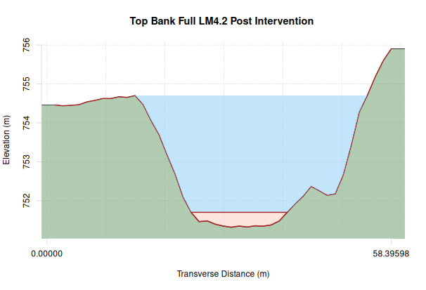
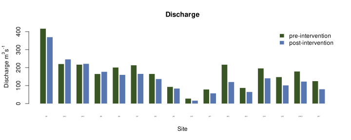
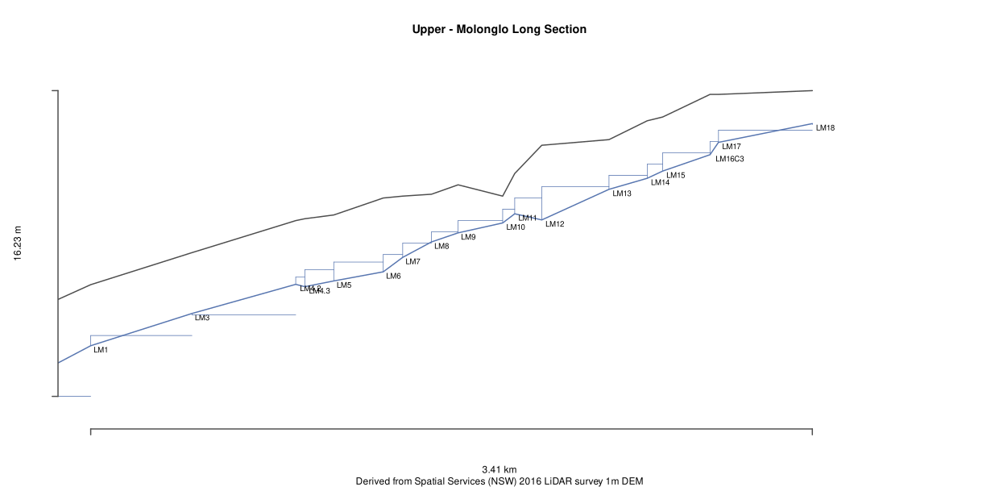

# Really Useful Hydraulic Modelling Scripts - Ruhms
This is a set of R scripts that I developed for rapidlly modelling waterways. It was originally intended for the purpose of preparing applications for controlled activity approval in NSW which require a 1D mannings model of bank-full flows on a site-by-site basis.

## Features
The primary use of Ruhms, throughout its development has been the analysis of leaky weir projects for the restoration of incised streams. For this reason, Ruhms allows the comparison of two scenarios, one post-intervention scenario where the cross sectional area of the waterway has been reduced. 

Combining the 1D hydraulic model of Ruhms outputs with a hydrological model, of the return period of flows, allows the user to predict the frequency of inundation of different floodplain surfaces. The pre- and post-intervention scenarios can then be interpreted in terms of increases to the frequency of flooding.

Ruhms was developed using R version 3.6.1 on GNU/linux and tested with R version 3.6.2 on Windows 10.

### Example outputs Ruhms can generate

#### Graphical representations of the stream cross sections

#### Graphs of the hydraulic conditions of the stream at each site

#### Graphs of the longitudinal profile of streams

### Numeric outputs:
 - 1D mannings models as csvs
 - 1D mannings models as Excel spreadsheets

Ruhms can calculate the following hydraulic parameters from elevation data and roughness:
 - Discharge
 - Velocity
 - Shear stress
 - Stream power
 - Froude numbers

# Inputs
Ruhms requires elevation data that describes the morphology of a waterway. The program works by sites. Each site must have cross section data provided as a table of distance and elevation values. This elevation data can easily be sampled from 2D rasters (such as those derived from LiDAR or photogrammerty, using desktop GIS software).

# Licence
Ruhms is licenced under the GNU General Public Licence (Version 3).
Please use, adapt and redistribute this code as much as you would like. If you do make a copy, please send me a pull request or acknowledge the lineage of your forked code. You'll need to apply the GPL to your fork. 

# Keywords
river, creek, waterway, stream, flow, hydraulics, Mannings, Mannings model, open channel, stormwater, natural stream

# Warnings
 - Ruhms currently uses a presumptuous formula for calculating hydraulic radius that will only hold for waterways that are much wider than they are deep.

# Tips
Ruhms requires the sp library to be installed. You may need to run install.packages('sp') from an R prompt before first using this script.

To easily use Ruhms under windows you will need to edit the registry to make R executable. Instructions can be found in the windows batch files named run_model.bat and optionally, all_svg_png.bat
